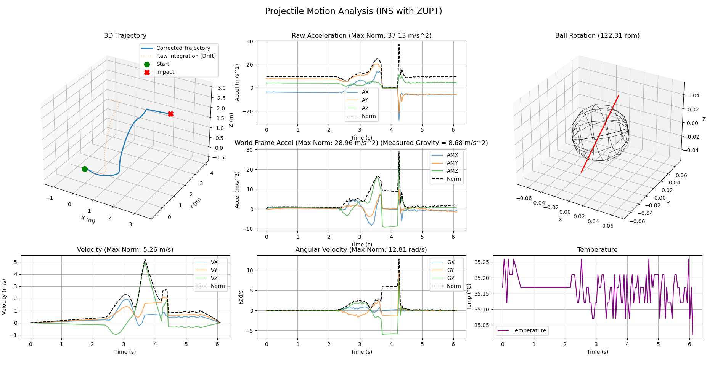
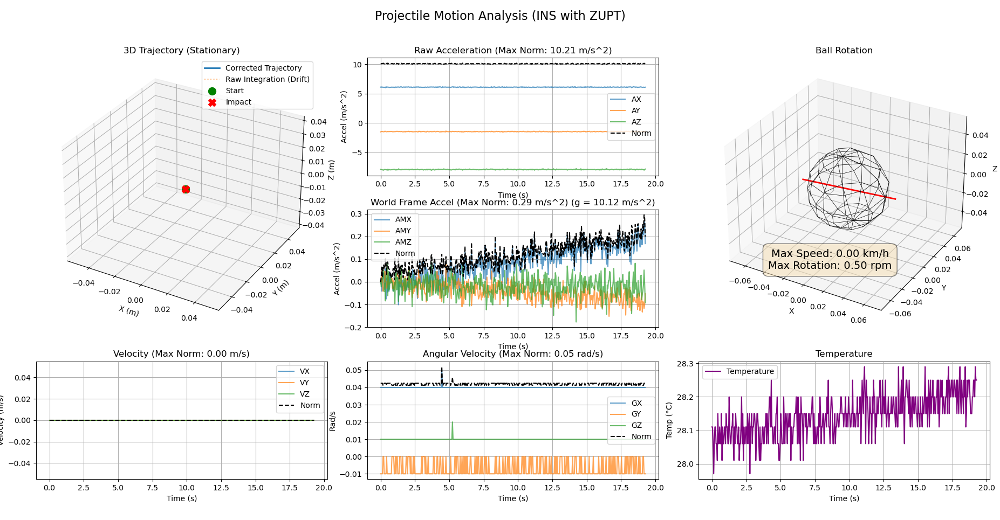
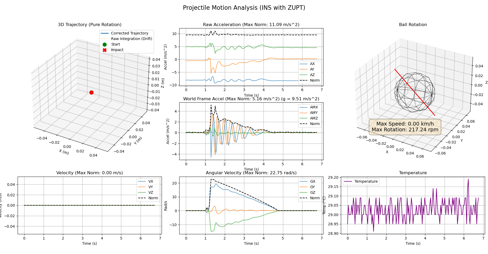

# Smart Ball Project

This project is designed to capture and visualize the motion of a smart ball equipped with an ESP32-C3 microcontroller and an IMU sensor. The system allows for real-time data streaming over Wi-Fi, data logging, and 3D visualization of the ball's trajectory.

## Features

- **Real-time Data Streaming:** The ESP32 firmware streams sensor data (accelerometer, gyroscope) over Wi-Fi.
- **Data Logging:** Python scripts are provided to log the sensor data for later analysis.
- **3D Visualization:** A Python script using Matplotlib and NumPy visualizes the captured motion data in 3D.
- **Data Relay:** A script to relay data from the ESP32 to other applications.
- **Client Test:** A script to test the connection to the ESP32 server.
- **Monitoring:** A script to monitor the raw data from the ESP32.

## Hardware

- **Microcontroller:** ESP32-C3 SuperMini
- **Sensor:** MPU-6050 6-axis accelerometer and gyroscope

## Firmware

The firmware for the ESP32-C3 is located in the `esp32-c3-supermini` directory. It is a PlatformIO project.

### Dependencies

- Adafruit MPU6050
- Adafruit Unified Sensor
- Adafruit BusIO

### Building and Flashing

1. Open the `esp32-c3-supermini` directory in Visual Studio Code with the PlatformIO extension.
1. Connect the ESP32-C3 to your computer.
1. Build and upload the firmware using the PlatformIO interface.

## Software

The software components are located in the `tools`, `visualization`, and `3d_visualization` directories.

### Requirements

- Python 3
- NumPy
- Matplotlib
- Pyglet

### Installation

```bash
pip install numpy matplotlib pyglet
```

### Usage

1. **Data Logger:** `python tools/data_logger.py`
1. **Data Relay:** `python tools/data_relay.py`
1. **Client Test:** `python tools/client_test.py`
1. **Monitor:** `python tools/monitor.py`
1. **2D Visualization:** `python visualization/visualization.py`
1. **3D Visualization:** `python 3d_visualization/visualization_3d.py`

## Visualizations

### Projectile Motion



### Stationary Ball



### Ball Rotation



## Directory Structure

```bash
.
├── 3d_visualization/     # 3D visualization scripts
├── esp32-c3-supermini/     # Firmware for the ESP32-C3
├── figure/                 # Figures for the README
├── mock_esp32/             # Mock ESP32 for testing
├── raw_data/               # Raw sensor data
├── tools/                  # Python scripts for data logging, relay, etc.
└── visualization/          # 2D visualization scripts
```
